## Часть 1. Установка ОС
1. установить VirtualBox
- переходим на сайт https://www.virtualbox.org/wiki/Downloads
- скачиваем macOS / Apple Silicon hosts
- также скачиваем расширение VirtualBox Extension Pack
- устанавливаем
2. скачать Ubuntu Server 20.04 LTS
- переходим на сайт https://releases.ubuntu.com/focal/
- Ubuntu 20.04.5 LTS (Focal Fossa)
3. создаем новую виртуальную машину в VirtualBox
- создать
- имя: Ubuntu 20.04 Server
4. настройка виртуальной машины и установка
- выделить созданную виртуальную машину и нажать "Настроить"
- раздел "Носители"
- контролер: Sata
- "Выбрать файл диска..."
- путь к скачанному файлу .iso
- путь к жесткому диску созданному
- запустить
- instal Ubuntu Server
- выполняем все шаги, перезагружается, вводим логин: Kri, пароль: 1
5. Проверяем версию Ubuntu, выполнив команду cat /etc/issue   

## Часть 2. Создание пользователя
- sudo adduser user1 (пароль:2) (sudo комманда - запуск команды под именем привилегированного пользователя)
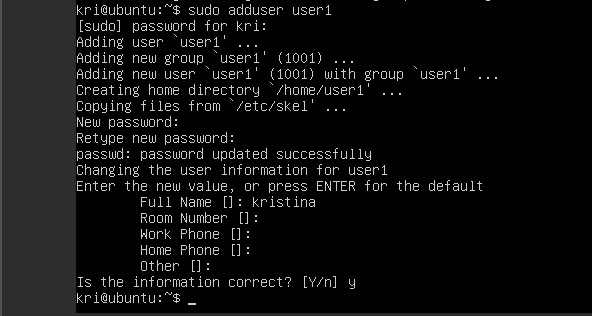
- sudo usermod -aG adm user1 (Добавление пользователя в группу adm: -a: "append", то есть добавить пользователя к группе. G: Указывает группу, в которую нужно добавить пользователя. adm: Имя группы.)
- Новый пользователь присутствует при выводе команды: cat /etc/passwd
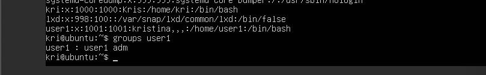
- groups user1 - проверить в какой группе данный пользователь

## Часть 3. Настройка сети ОС
1. Установите имя машины как user-1:
- Чтобы установить имя машины user1 выполните команду: sudo hostnamectl set-hostname user1
- Проверка изменений: hostname
- 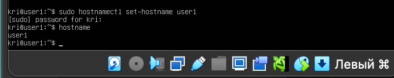
2. Установите часовой пояс, соответствующий вашему текущему местоположению.
- Проверьте текущий часовой пояс: Введите команду timedatectl
- Просмотр всех доступных часовых поясов: timedatectl list-timezones
- Установка часового пояса: sudo timedatectl set-timezone Europe/Moscow
- 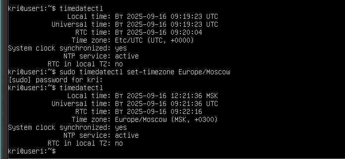
3. Выведите имена сетевых интерфейсов с помощью консольной команды.
- ip link
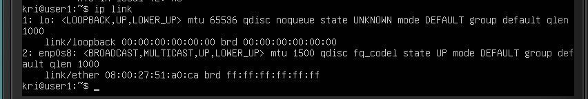
- В отчете дайте пояснение наличию интерфейса lo.  
**Интерфейс lo (или loopback)** — это виртуальный сетевой интерфейс, присутствующий по умолчанию в любой операционной системе Linux, который позволяет компьютеру взаимодействовать самому с собой без участия физических сетевых устройств.  
**Основные функции:**
- Локальная коммуникация - позволяет сетевым приложениям общаться с другими приложениями на том же компьютере
- IP-адрес 127.0.0.1 - всегда имеет этот адрес (localhost)
- Тестирование сетевого стека - проверка работы сетевых функций без физического подключения.     
**Почему он важен:**
- Отладка - помогает определить, проблема в сети или в приложении
- Разработка - позволяет тестировать клиент-серверные приложения на одной машине
- Безопасность - некоторые службы настраиваются только на listen 127.0.0.1 для локального доступа
4. Используйте консольную команду, чтобы получить IP-адрес устройства, с которым вы работаете, от DHCP-сервера.
- Чтобы освободить текущий IP-адрес и запросить новый:
sudo dhclient -r
sudo dhclient
- Проверка полученного IP-адреса: ip a show

- Расшифруйте DHCP в отчете.
**DHCP - Dynamic Host Configuration Protocol.**.   
Протокол динамической конфигурации узла - это сетевой протокол, который автоматически назначает IP-адреса и другие сетевые параметры устройствам в сети.   
**Для чего используется DHCP:**
- Автоматическое назначение IP-адресов: Устройствам не требуется ручная настройка IP-адресов, что особенно важно для больших сетей. 
- Предоставление других сетевых параметров: DHCP-сервер также передает клиентам маску подсети, шлюз по умолчанию и адреса DNS-серверов. 
- Централизованное управление: Упрощает администраторам контроль над использованием IP-адресов и управление ими. 
- Снижение ошибок: Уменьшает вероятность назначения одного IP-адреса двум разным устройствам, что может вызвать проблемы в сети.   
**Как работает DHCP:**
- Запрос (Discover): Подключенное к сети устройство (клиент) отправляет запрос на поиск DHCP-сервера. 
- Предложение (Offer): DHCP-сервер находит запрос и предлагает клиенту IP-адрес и другие параметры. 
- Запрос (Request): Клиент принимает предложение и запрашивает конкретный IP-адрес. 
- Подтверждение (Acknowledge): Сервер подтверждает выдачу IP-адреса клиенту на определенный срок (срок аренды). 
5. Определите и отобразите внешний IP-адрес шлюза (ip) и внутренний IP-адрес шлюза, также известный как IP-адрес по умолчанию (gw). 
- Внутренний IP-адрес шлюза (default gateway), локальный адрес роутера в вашей сети: ip route show default

- Внешний IP-адрес шлюза (публичный IP), публичный адрес, выданный провайдером: curl ifconfig.me

6. Установите статические (заданные вручную, а не полученные от DHCP-сервера) настройки IP, GW, DNS (используйте публичные DNS-серверы, например, 1.1.1.1 или 8.8.8.8).
- Перейдите в каталог /etc/netplan/: cd /etc/netplan/
- Посмотрите список файлов с помощью команды ls и определите имя файла конфигурации: 00-installer-config.yaml.
- Отредактируйте файл Netplan: sudo nano /etc/netplan/00-installer-config.yaml
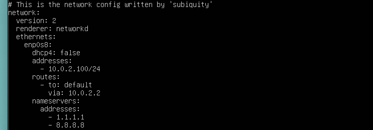
Определение текущих настроек:
Посмотреть текущий IP и шлюз:
ip a (10.0.2.15/24)
ip route show default (10.0.2.2)
- Применяем настройки: sudo netplan apply
7. Перезагрузите виртуальную машину. Убедитесь, что статические сетевые настройки (IP, GW, DNS) соответствуют настройкам, заданным в предыдущем пункте.
- перезагрузка: sudo reboot
- Проверка IP-адреса: ip a show
- Проверка шлюза по умолчанию: ip route show default
- Проверка DNS-серверов: cat /run/systemd/resolve/resolv.conf
- Выполните успешный пинг удалённых хостов 1.1.1.1 и ya.ru: ping -c 4 1.1.1.1, ping -c 4 ya.ru
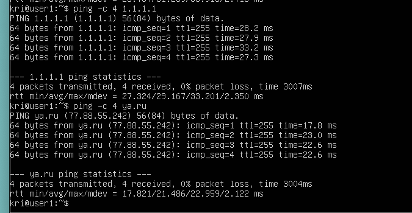

## Часть 4. Обновление ОС
- Введите команду sudo apt update. Эта команда обновит информацию о доступных пакетах из репозиториев, но не установит никаких новых версий. 
- sudo apt upgrade: Обновит все установленные пакеты до последних версий, доступных в репозиториях, но не удалит никакие пакеты и не установит новые, если это не требуется для обеспечения зависимостей. 
- sudo apt full-upgrade: Установит все обновления, включая те, которые требуют добавления новых пакетов или удаления старых.    
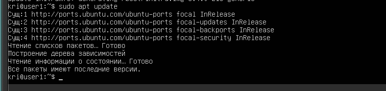

## Часть 5. Использование команды sudo 
1. Команда sudo позволяет обычным пользователям выполнять команды с правами администратора (суперпользователя), запрашивая при этом пароль текущего пользователя.
2. 
- добавить пользователя в группу sudo: sudo usermod -aG sudo имя_пользователя
- перезагрузить: sudo reboot
- зайти под user1 (пароль: 2)
- Изменение имени хоста: sudo hostnamectl set-hostname new-hostname(ubunty-user1)
- Обновление файла hosts: sudo nano /etc/hosts
127.0.1.1 старое-имя-хоста - 127.0.1.1 ubuntu-user1
- Проверка изменений: hostname
3. 

## Часть 6. Установка и настройка службы времени
Команда: timedatectl show.   
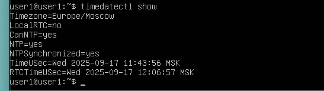

## Часть 7. Установка и использование текстовых редакторов
1. 
- Установка Vim: sudo apt install vim -y.   
- Установка Nano: sudo apt install nano -y
- Установка Joe: sudo apt install joe -y
2. Создание файлов в каждом редакторе.   
- **Vim - создание файла test_vim.txt:**  
  - vim test_vim.txt
  - Нажимаю i для перехода в режим вставки
  - Ввожу текст: Ollyvala
  - Нажимаю Esc для выхода из режима вставки
  - Ввожу :wq и Enter для сохранения и выхода.   
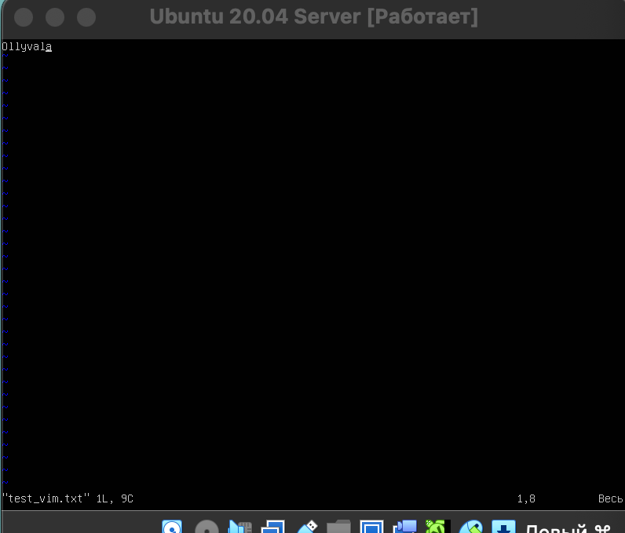.    
- **Nano - создание файла test_nano.txt.**    
  - nano test_nano.txt
  - Ввожу текст: Ollyvala
  - Нажимаю Ctrl+X для выхода
  - На вопрос "Save modified buffer?" отвечаю Y
  - Подтверждаю имя файла Enter.    
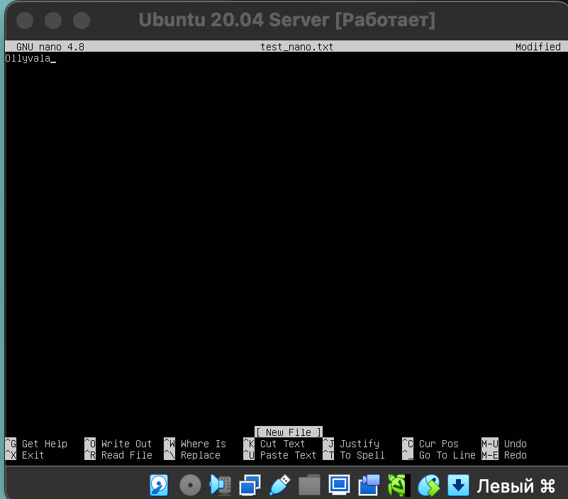.    
- **Joe - создание файла test_joe.txt**.   
  - joe test_joe.txt
  - Ввожу текст: Ollyvala
  - Нажимаю Ctrl+K затем X для сохранения и выхода 
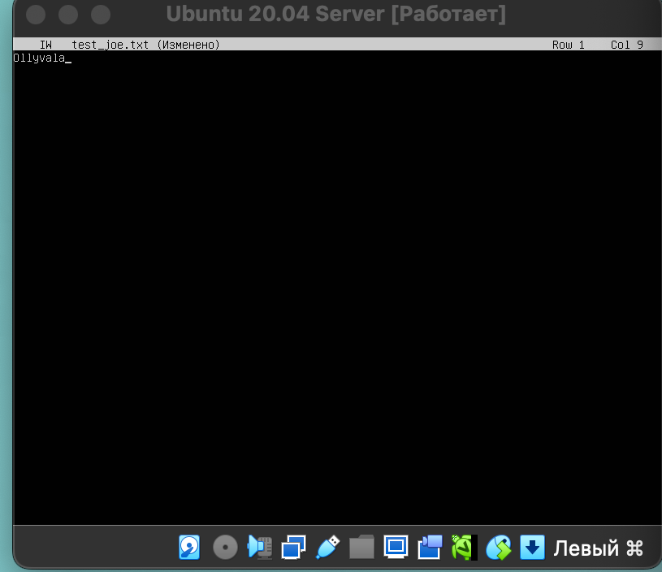.   
3. Редактирование файлов, не сохраняя изменения.    
- **Vim - редактирование test_vim.txt**.    
  - Открываем файл: vim test_vim.txt
  - Нажимаю i для перехода в режим вставки
  - Удаляю "Ollyvala" и ввожу "21 School 21"
  - Нажимаю Esc для выхода из режима вставки
  - Для выхода без сохранения: :q! → Enter.    

- **Nano - редактирование test_nano.txt**.    
  - nano test_nano.txt
  - Удаляю "Ollyvala" и ввожу "21 School 21"
  - Для выхода без сохранения: Ctrl+X → N
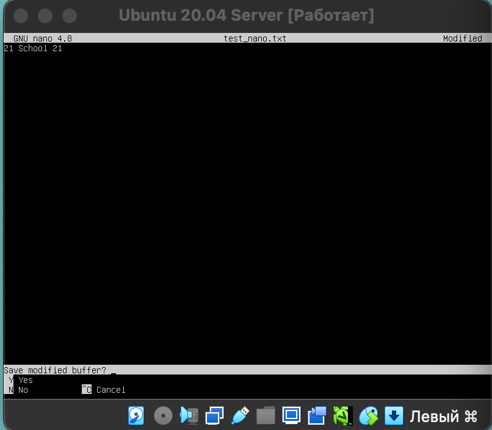.   
- **Joe - редактирование test_joe.txt**.  
  - joe test_joe.txt
  - Удаляю "Ollyvala" и ввожу "21 School 21"
  - Для выхода без сохранения: Ctrl+C → y.    
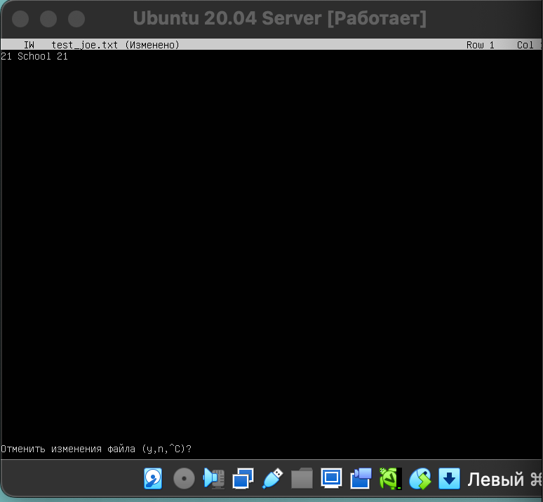
4. поиск по содержимому файла (слову) и замены слова на любое другое.
- **Vim - поиск и замена в test_vim.txt**.    
  - Поиск: /слово      
  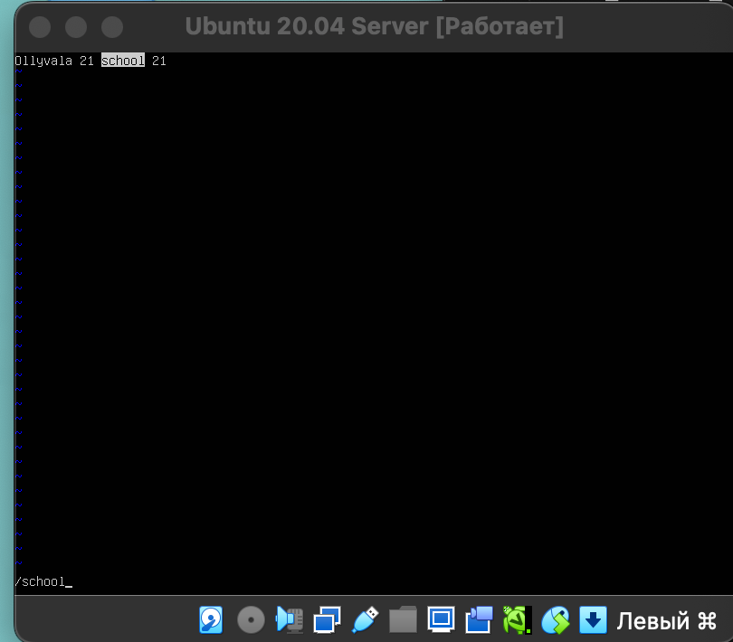.   
  - Замена во всем файле: :%s/старое/новое/g  enter.   
  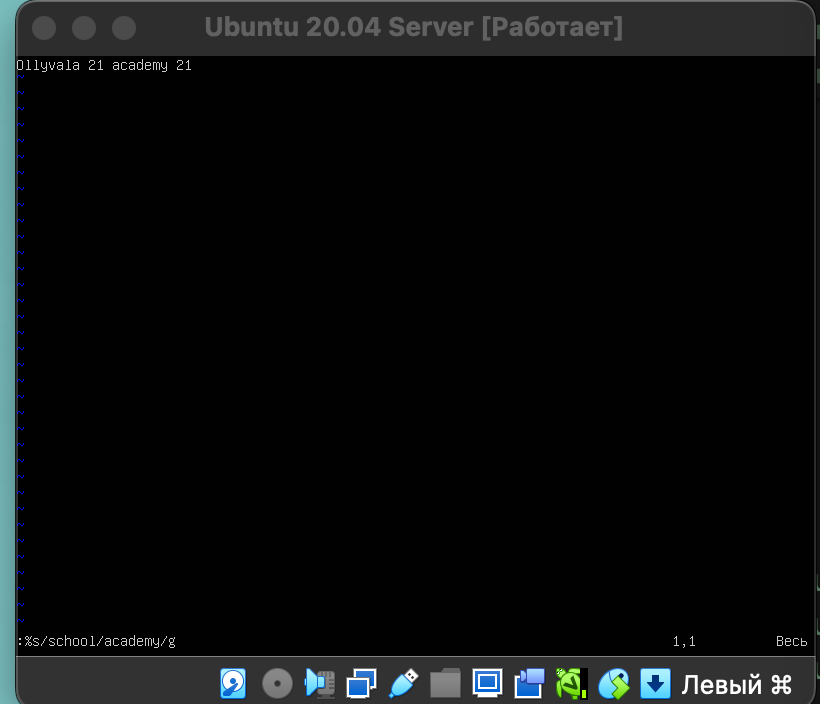.    
- **Nano - поиск и замена в test_nano.txt**.   
  - Поиск: Ctrl+W → ввожу School → Enter.   
  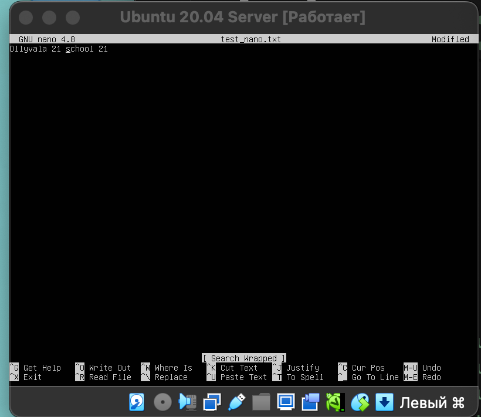.   
  - Замена: Ctrl+\ → ввожу School → Enter → ввожу Academy → Enter → y.   
  - Выбираю A для замены всех вхождений.    
  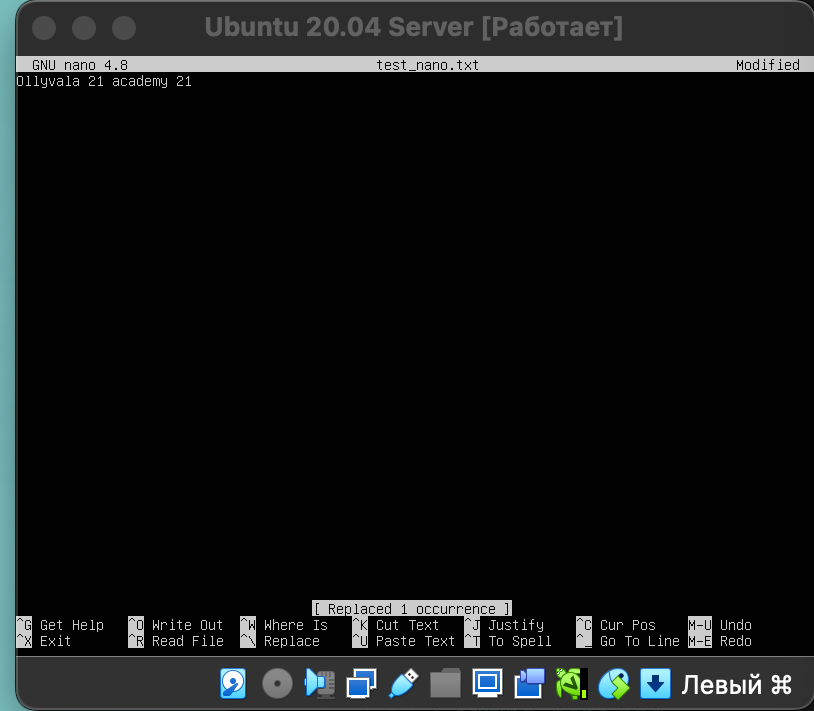.  
- **Joe - поиск и замена в test_joe.txt**.  
  - Поиск: Ctrl+K → F → ввожу School → Enter.   
  - Замена: Ctrl+K → R → ввожу School → Enter → ввожу Academy → Enter
  - Выбираю A для замены всех вхождений.    

## Часть 8. Установка и базовая настройка сервиса SSHD
1. Установка службы SSHd:  sudo apt install openssh-server
2. автозапуск службы: sudo systemctl enable sshd
3. Проверьте статус службы: sudo systemctl status sshd.  
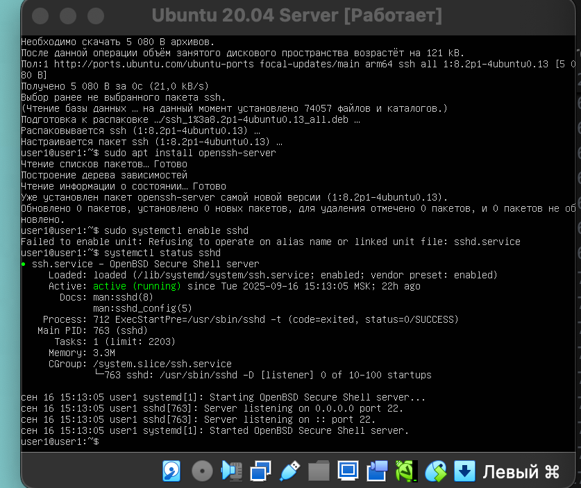.   
4. Сбросьте службу SSHd на порт 2022.
- Откройте конфигурационный файл SSH: Выполните команду, чтобы открыть файл /etc/ssh/sshd_config в текстовом редакторе nano с правами администратора.
- Найдите и измените порт: В открывшемся файле найдите строку, начинающуюся с Port 22. Если строка закомментирована (начинается с #), уберите символ #. Замените число 22 на 2022.
- Сохраните изменения: Нажмите Ctrl+X, затем Y и Enter для сохранения файла и выхода из nano. 
- Перезапустите SSH-сервер: sudo systemctl restart sshd
- Настройка брандмауэра (UFW): sudo ufw allow 2022/tcp
- Подключитесь к новому порту: ssh ваш_пользователь@localhost -p 2022
5. Команда: ps aux | grep sshd.    
- ps: Это команда Linux, которая используется для отображения информации о запущенных процессах в системе. Она предоставляет данные о процессах и их состоянии, позволяя пользователям отслеживать и управлять ими. 
- aux (ключи): Это три отдельных ключа, которые часто используются вместе:
  - a: Показывает информацию о всех процессах, запущенных другими пользователями, а также процессах, привязанных к терминалу. 
  - u: Отображает информацию о процессах в более подробном, "пользовательском" формате, включая имя пользователя, владеющего процессом, приоритет и использование ресурсов. 
  - x: Показывает все процессы, даже те, которые не привязаны к какому-либо терминалу (например, фоновые службы).     
В итоге, комбинация aux выводит подробный список всех процессов, запущенных на сервере, независимо от пользователя и терминала.    
- | (пайп, конвейер): Это специальный символ в командной строке, который перенаправляет вывод одной команды на ввод другой. В данном случае, вывод команды ps aux направляется на вход команды grep.    
- grep: Эта команда используется для поиска строк, соответствующих заданному шаблону (в данном случае, "sshd"). Она фильтрует входные данные и выводит только те строки, которые содержат искомый текст.     
**Как это работает:**
- ps aux генерирует полный список всех запущенных процессов, включая их PID (идентификатор процесса), пользователя-владельца, потребление ресурсов и другие детали. 
- Пайп | передает этот список команде grep.
- grep sshd сканирует этот список и находит все строки, где встречается "sshd", что обычно указывает на запущенный процесс sshd (SSH-демон). 
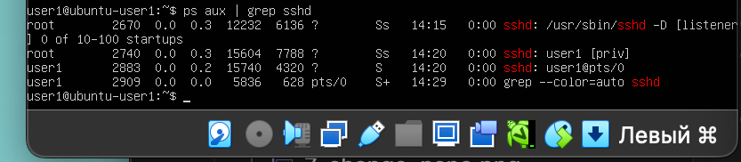.    
6. 
- Устанавливаем команду netstat: sudo apt install net-tools -y 
- Выполняем команду netstat: netstat -tan | grep :2022

**netstat - Network Statistics** - Утилита для отображения сетевых соединений и статистики.   
- t - TCP connections. Показывать только TCP соединения
- a - All connections. Показывать все соединения (включая listening)
- n - Numeric output. Выводить числовые адреса вместо имен
- | grep :2022 - фильтр по порту. Ищем строки, содержащие порт 2022
7. Объясните значение ключей -tan, значение каждого выходного столбца, значение 0.0.0.0. в отчете:
- tcp - тип протокола (TCP)
- 0 - количество байт в очереди (0)
- 0.0.0.0:2022 - локальный адрес и порт (слушает на всех интерфейсах)
- 0.0.0.0:* - удаленный адрес и порт (любой)
- LISTEN - состояние (ожидает подключений)

## Часть 9. Установка и использование утилит top , htop
1. Установка утилит 
- sudo apt install top (обычно уже установлен)
- sudo apt install htop 
2. Из вывода команды top определите и запишите в отчет:
- время безотказной работы: 2:40
- количество авторизованных пользователей: 2
- средняя загрузка системы: load average: 0,01, 0,01, 0,00 (1 минута: 0.01, 5 минут: 0.01, 15 минут: 0.00. Объяснение: Load average < 1.0 означает низкую нагрузку)
- общее количество процессов: Tasks: 94 total
- загрузка процессора: CPU(s). Idle: 100.0% - процессор практически свободен. Общая загрузка: 0.0% (100% - idle)
- загрузка памяти: MB Mem : 1956,9 total, 1142,9 free, 138,4 used, 675,6 buff/cache. 
  - Total: 1956.9 MB
  - **Used: 138.4 MB (7.1% от общего объема)**
  - Free: 1142.9 MB
  - Buff/Cache: 675.6 MB
- pid процесса с наибольшим использованием памяти: Анализ столбца %MEM:    
  - systemd - PID 1: 0.5% памяти (10300 KB)
  - kworker/0:2-events - PID 2392: 0.3% памяти
  - Наибольшее использование: PID 1 (systemd) - 0.5% памяти
- pid процесса, занимающего больше всего процессорного времени: Анализ столбца TIME+:
  - kworker/0:2-events - PID 2392: 0:02.30
  - rcu_sched - PID 10: 0:00.24
  - migration/0 - PID 11: 0:00.14
  - Наибольшее CPU время: PID 2392 (kworker) - 2 минуты 30 секунд
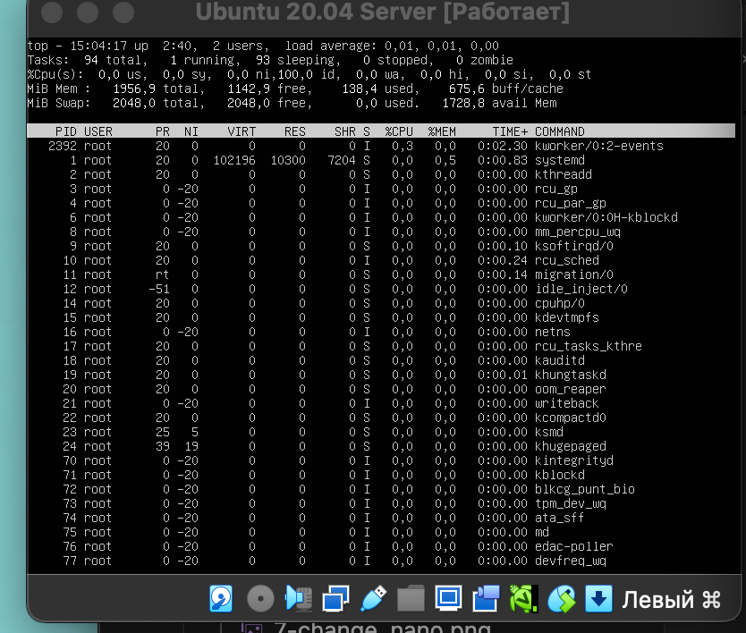.   
q - выход
3. 
- сортировка по PID: htop --sort-key=PID     
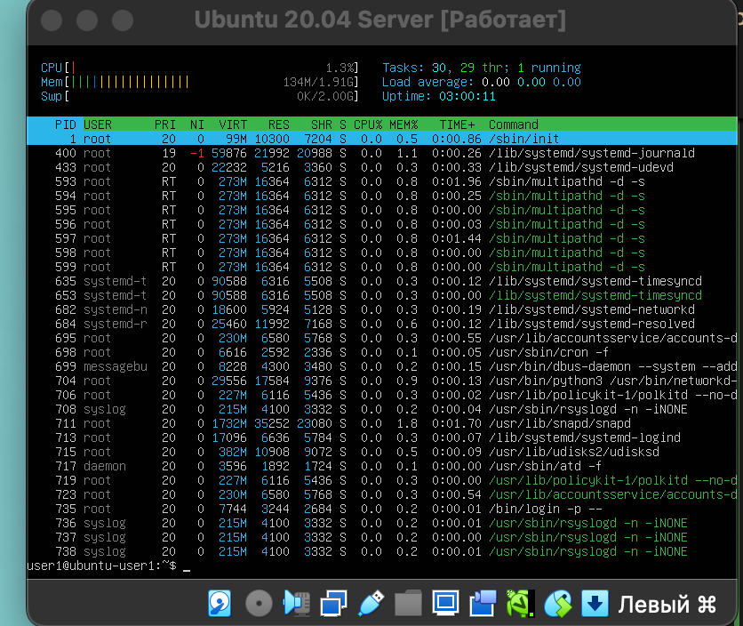
- сортировка по PERCENT_CPU: htop --sort-key=PERCENT_CPU.   
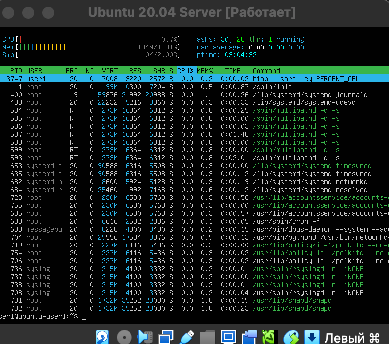
- сортировка по PERCENT_MEM: htop --sort-key=PERCENT_MEM.     
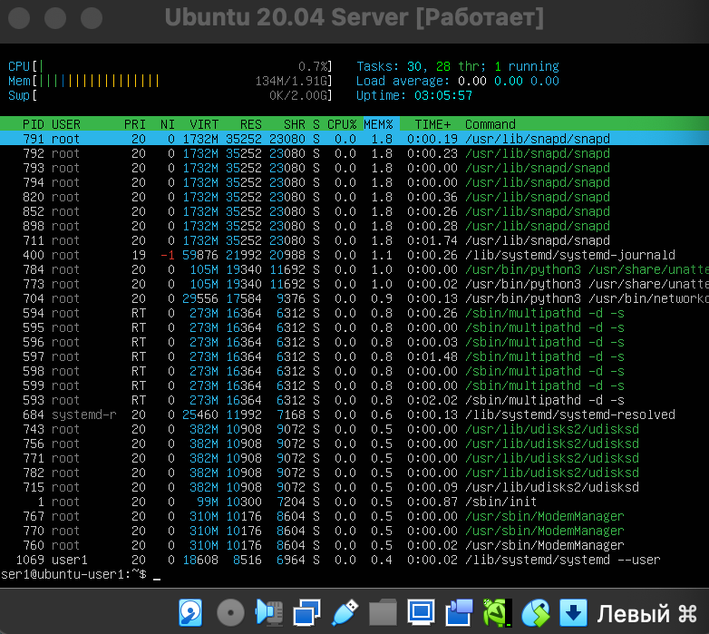
- сортировка по TIME: htop --sort-key=TIME.      
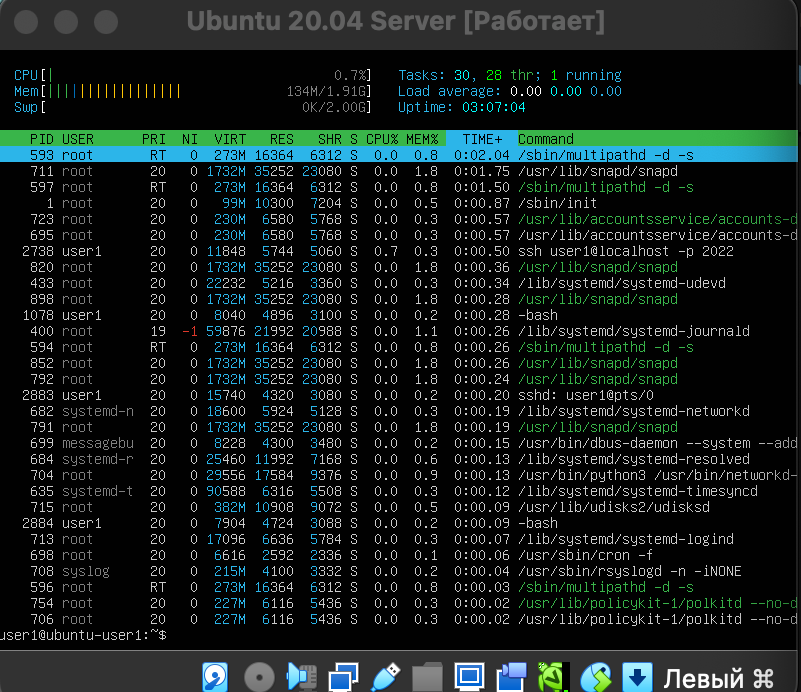
- отфильтровано для процесса sshd:
  В запущенном htop:
    - Нажимаю F4 или \ (Filter)   
    - Ввожу sshd
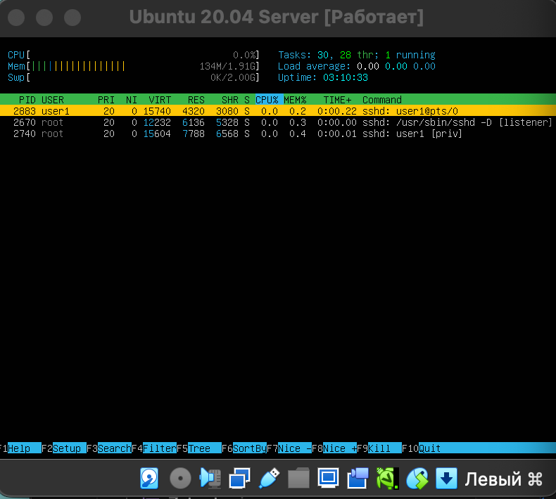
- с процессом syslog, найденным с помощью поиска:
  В запущенном htop:
    - Нажимаю F3 или / (Search)
    - Ввожу syslog или rsyslog   
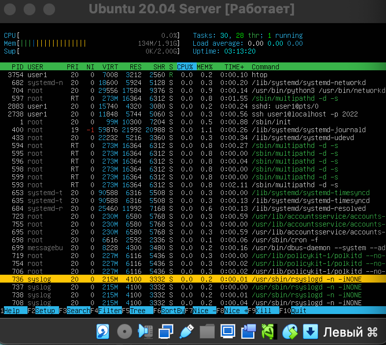
- с добавленным выводом имени хоста, часов и времени безотказной работы: 
  - Время безотказной работы	3 часа 45 минуты

  - для вывода имени хоста и даты использовались команды: hostname и date
.    
q - выход

## Часть 10. Использование утилиты fdisk
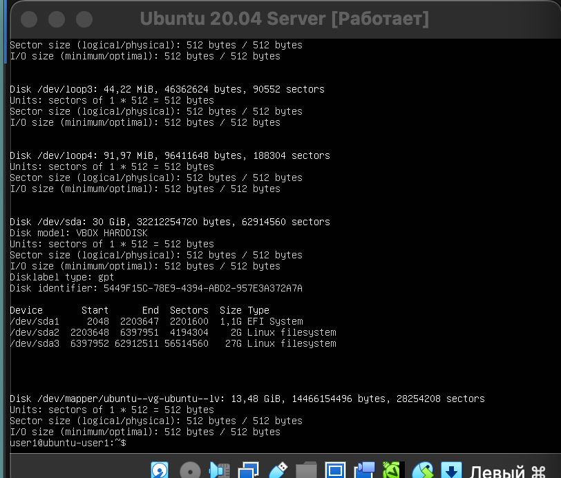.  
- название жесткого диска - /dev/sda Disk model: VBOX HARDDISK
- емкость - 30 GiB
- количество секторов - 62914560
- размер раздела подкачки - Отсутствует (используется swap file - файл подкачки. Обычный файл в файловой системе. Легко изменить размер или удалить. Современный рекомендуемый подход)

## Часть 11. Использование утилиты df
1. df -h.  
Результат: Показывает размеры в удобном формате (KB, MB, GB), делая вывод более понятным для человека. 
В отчете пишем для корневого раздела (/):
- размер раздела - 14G
- используемое пространство - 4.6G
- свободное пространство - 7.9G
- процент использования - 37%
- Определите и запишите в отчете единицу измерения: гигабайт.   

2. В отчете пишем для корневого раздела (/):
- размер раздела - 14G
- используемое пространство - 4.6G
- свободное пространство - 7.9G
- процент использования - 37%
- Определите и запишите в отчет тип файловой системы для раздела: ext4.  
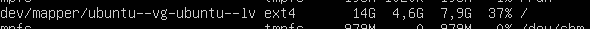

## Часть 12. Использование утилиты du
1. Выполните команду du.    
-  Размер папок в байтах: sudo du -sb /home /var /var/log   
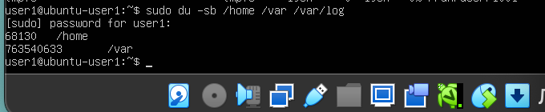.   
- Размер папок в удобочитаемом формате: sudo du -sh /home /var /var/log 
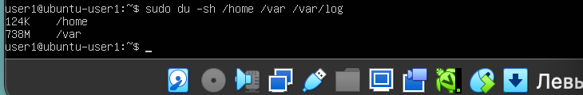.  
2. Размер каждого элемента в /var/log: sudo du -sh /var/log/*   
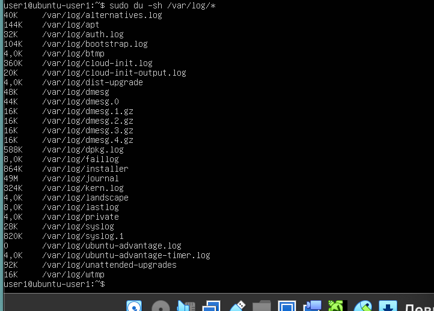

**du - disk usage**
- s - summary (только итоговая сумма)
- b - bytes (размер в байтах)
- h - human readable (удобочитаемый формат)
- c - total (показать общую сумму)

## Часть 13. Установка и использование утилиты ncdu
1. Установите утилиту ncdu: sudo apt install ncdu 
2. Вывести размер папок /home, /var, /var/log 
- ncdu /home   
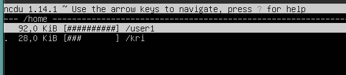.   
выход q    
- sudo ncdu /var  
.  
- sudo ncdu /var/log   
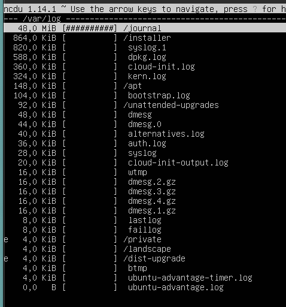.   

## Часть 14. Работа с системными журналами
1. Запишите в отчет время последнего успешного входа в систему, имя пользователя и способ входа: 
- sudo grep "Accepted" /var/log/auth.log | tail -5      
(grep - утилита для поиска текста, "Accepted" - ищем успешные аутентификации, /var/log/auth.log - где хранятся логи входа, | tail -5 - только свежие записи).  
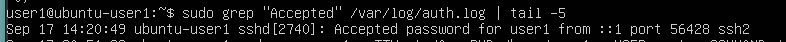.  
2. Просмотр системных логов
- Просмотр последних записей в syslog: sudo tail -10 /var/log/syslog
- Просмотр dmesg: sudo tail -10 /var/log/dmesg
3. Перезапускаем службу SSHd: sudo systemctl restart ssh
4. Просмотр последних записей в syslog: sudo tail -10 /var/log/syslog     
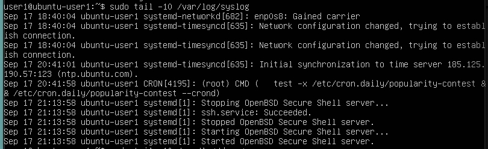
5. Просмотр последних записей в auth.log: sudo grep "sshd" /var/log/auth.log | tail -10   
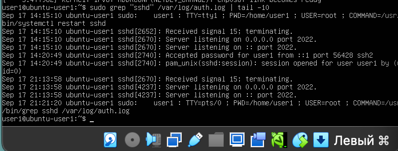

## Часть 15. Использование планировщика заданий CRON
1. Открываем crontab для редактирования: crontab -e
2. Добавляем строку в конец файла: */2 * * * * uptime 
- */2: означает "каждые 2 минуты".
- четыре звездочки означают "каждый час, каждый день месяца, каждый месяц, каждый день недели". 
3. сохраняем ctrl+x y
4. ищем строки в системных журналах о выполнении: sudo grep CRON /var/log/syslog | grep uptime

5. Отобразить список текущих заданий для CRON: crontab -l 
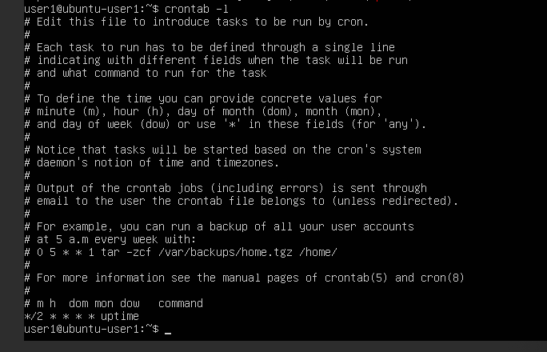
6. Удаляем все задания cron: crontab -r
7. Проверяем, что очистилось: crontab -l
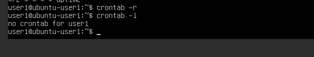