## Часть 1. Готовый докер
1. Возьмите официальный образ Docker от nginx и загрузите его с помощью docker pull   
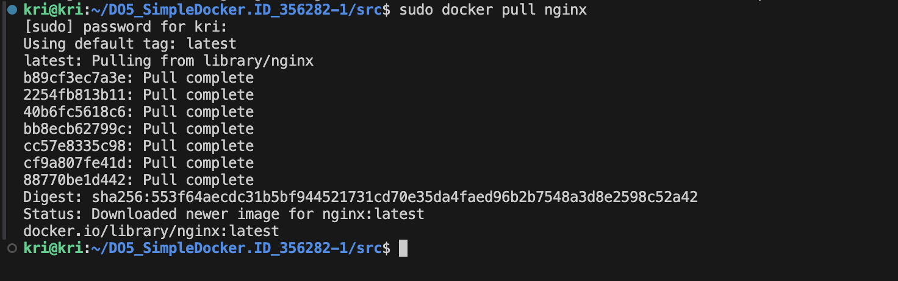   
2. Проверьте наличие образа Docker с помощью docker images   
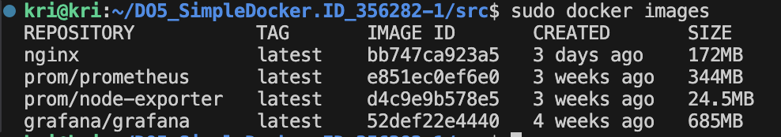    
3. Запустите образ Docker с помощью docker run -d [image_id|repository]  
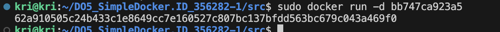   
4. Проверьте, что образ запущен с docker ps. 
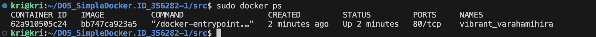   
5. Просмотреть информацию о контейнере с помощью docker inspect [container_id|container_name]. Из вывода команды определите и запишите в отчет размер контейнера, список сопоставленных портов и IP-адрес контейнера.
- размер контейнера - 1.09kB (virtual 172MB) (команда sudo docker ps -s)
- список сопоставленных портов - 80/tcp (не опубликован на хост)
- IP-адрес контейнера - 172.17.0.2
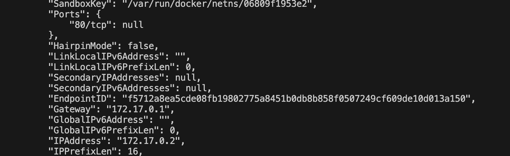   
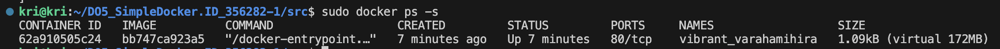  
6. Остановите Docker-контейнер с помощью docker stop [container_id|container_name]  
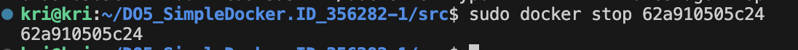
7. Проверьте, остановился ли контейнер docker ps  
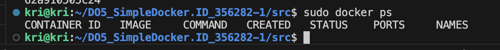  
8. Запустите Docker с портами 80 и 443 в контейнере, сопоставленными с теми же портами на локальной машине, с помощью команды run  
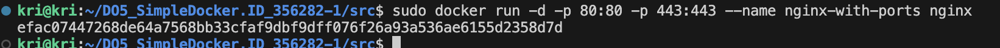
9. Проверьте, доступна ли стартовая страница nginx в браузере по адресу localhost:80 
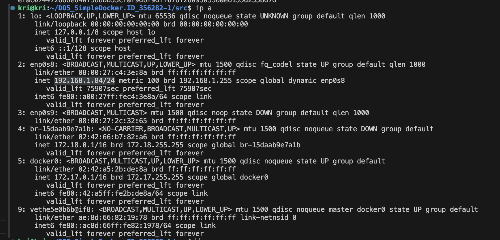  
   
10. Перезапустите Docker-контейнер с помощью docker restart [container_id|container_name]   
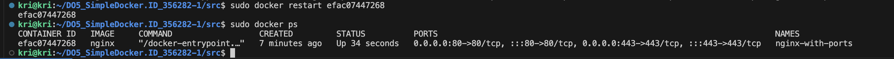

## Часть 2. Операции с контейнером
1. Прочитайте файл конфигурации nginx.conf внутри контейнера Docker с помощью команды exec: sudo docker exec nginx-with-ports cat /etc/nginx/nginx.conf 
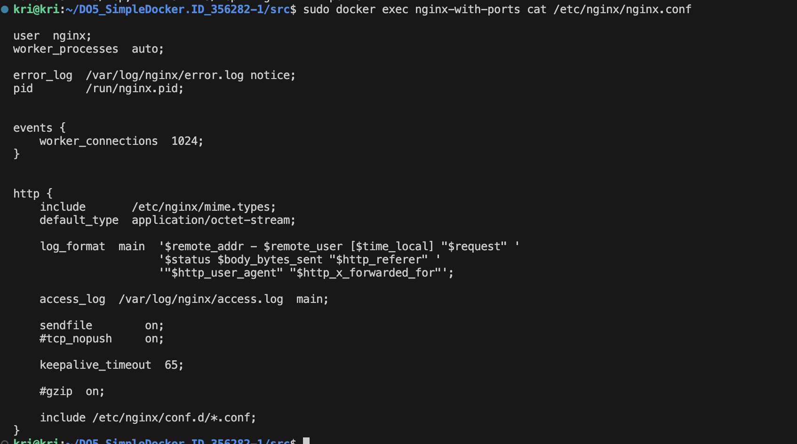   
2. Создайте файл nginx.conf на локальной машине: cd ~, nano nginx.conf   
3. Настройте его в пути /status для возврата страницы состояния сервера nginx  
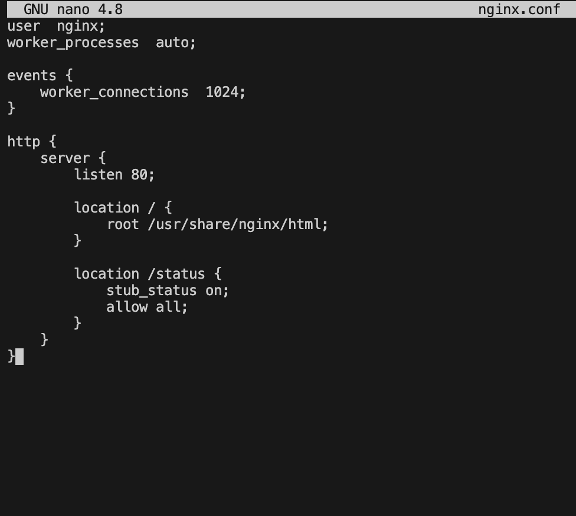   
4. Скопируйте созданный файл nginx.conf внутрь образа Docker с помощью docker cp команды  
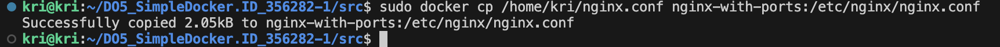   
5. Перезапустите nginx внутри образа Docker с помощью exec: sudo docker exec nginx-with-ports nginx -s reload   
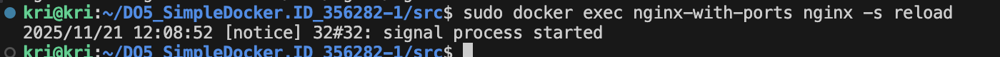   
6. Убедитесь, что localhost:80/status возвращает страницу состояния сервера nginx  
   
7. Экспортируйте контейнер в файл container.tar с помощью команды export: sudo docker export nginx-with-ports > container.tar     
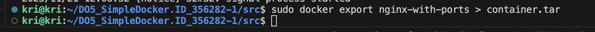  
8. Остановите контейнер: sudo docker stop nginx-with-ports   
   
9. Удалите изображение, docker rmi [image_id|repository]не удаляя предварительно контейнер: sudo docker rmi nginx - Docker не позволит удалить образ, если от него зависят контейнеры (даже остановленные). Это защитная мера для предотвращения потери данных. Используем флаг -f: sudo docker rmi -f nginx  
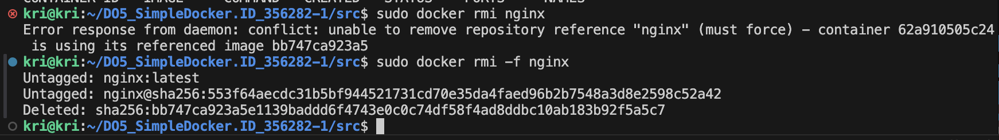  
10. Удалить остановленный контейнер: sudo docker rm efac07447268   
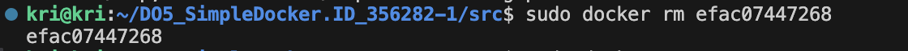   
11. Импортируйте контейнер обратно с помощью команды import: sudo docker import container.tar my-nginx:imported  
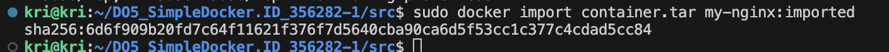  
12. Запустите импортированный контейнер: sudo docker run -d -p 80:80 -p 443:443 --name nginx-imported my-nginx:imported nginx -g "daemon off;"  
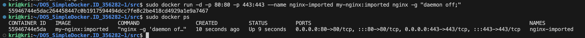  
13. Убедитесь, что localhost:80/status возвращает страницу состояния сервера nginx.   
   

## Часть 3. Мини веб-сервер
1. Напишем мини-сервер на C и FastCgi, который будет возвращать простейшую страничку с надписью Hello World! и сохраняем в fastcgi_server.c
2. Компиляция: gcc -std=c11 -Wall -Wextra -Werror fastcgi_server.c -o fastcgi_server -lfcgi
3. Запускаем ./fastcgi_server 
4. Напишем свой nginx.conf, который будет перенаправлять все запросы с 81 порта на 127.0.0.1:8080
5. Запускаем nginx в втором терминале nginx -c /путь к файлу/nginx.conf
   sudo nginx -c /home/kri/DO5_SimpleDocker.ID_356282-1/src/nginx/nginx.conf 
   - если порт занят посмотреть sudo lsof -i :81
   - освободить порт sudo fuser -k 81/tcp
6. Проверяем curl localhost:81
7. http://192.168.1.84:81/

Остановить nginx: sudo nginx -s stop

Удалить скомпилированный файл: sudo rm fastcgi_server

## Часть 4. Ваш собственный докер
1. Пишем свой докер-образ (создаем Dockerfile)
2. Собираем написанный докер-образ через docker build: docker build -t part4:1.0 -f Dockerfile4 .
3. Проверяем через docker images, что все собралось корректно: docker images
4. Запустите собранный образ Docker, сопоставив порт 81 с портом 80 на локальной машине и сопоставив папку ./nginx внутри контейнера с адресом, по которому находятся файлы конфигурации nginx: docker run -d -p 80:81 -v $(pwd)/nginx/nginx.conf:/etc/nginx/nginx.conf --name test4 part4:1.0
5. если не работает 4 пункт: docker rm test4
6. Проверьте, что страница написанного мини-сервера доступна на localhost:80: curl localhost и curl localhost/status 
7. в браузере: http://192.168.1.84 и http://192.168.1.84/status

Остановить контейнер: docker stop test4
Удалить контейнер: docker rm test4
Чтобы удалить ненужную собрнную версию: docker rmi part4:2.0

## Часть 5. Доккл
1. Сохраняем образ в файл: docker save -o part4_1.0.tar part4:1.0
2. Проверяем файл: dockle --input part4_1.0.tar
3. Собираем докер-образ 5: docker build -t part5:1.0 -f Dockerfile5 .
4. Сохраняем образ в файл: docker save -o part5_1.0.tar part5:1.0
5. Проверяем файл с игнорированием CIS-DI-0010: dockle -i CIS-DI-0010 --input part5_1.0.tar
6. Удаляем файл: rm part4_1.0.tar
7. Удаляем файл: rm part5_1.0.tar

## Часть 6. Базовый Docker Compose
1. docker-compose build
2. docker-compose up -d
3. docker compose ps
4. curl localhost
5. curl localhost/status
6. в браузере: http://192.168.1.84 и http://192.168.1.84/status
7. docker-compose down